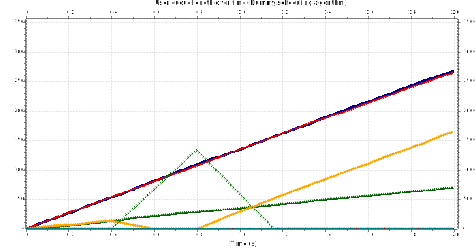
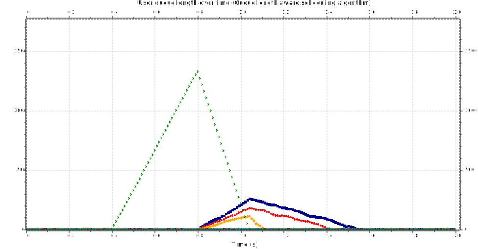

# Analysis for eight users

## Queue length

We can clearly see the problems that come with constant allocation and not taking into account user query lengths when using the Dummy algorithm.

The Query Aware algorithm shows much better results. We can see that when the unlucky user reconnects - 0.8s - and is assigned a much greater weight, some of the other users get left behind.

This continues until the unlucky user gets 'up-to-date' - after the 1s mark. At the same time, we can also see the formation of a top for the other users.

After this, we see a normalization in which the lengths of the queries return to the values from before the unlucky user's disconnect.
