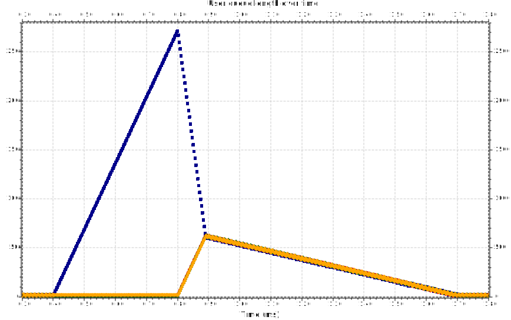

# The *'First come, first served'* scheduler

The *First in, first out* (FIFO) or *First come, first served* (FCFS) takes into account only the time the packets entered a particular queue.

The algorithm will cycle through all the queues and look for the oldest message from the bunch. This goes on until the channels allocated are depleted.

In comparison to the Weighted Round-Robin, this algorithm not only affects all the users, but also keeps them 'behind' for a considerable amount of time - more than WRR does.

When the user reconnects, we can see the sudden prioritisation of their messages - due to them being stale sitting in the queue.

Their messages are going to be prioritised until we get to that point of balance where the two lines meet: the users' messages will be prioritised 'evenly', like at the beginning.
