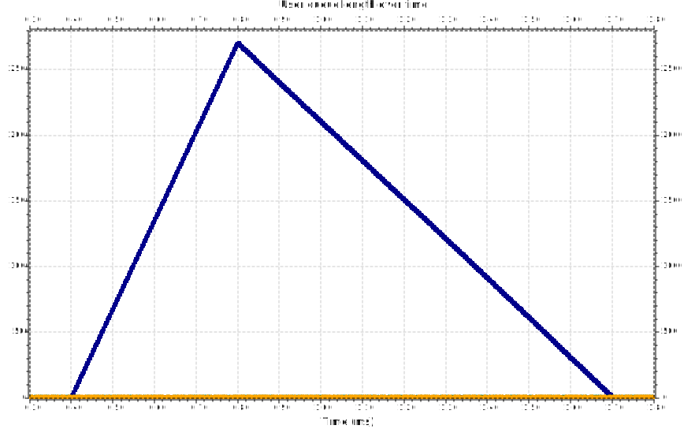
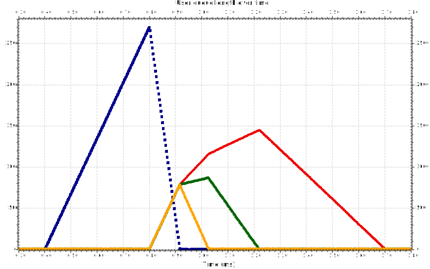

# Analysis for four users

## Setup

We follow the recommended conditions:

- a scheduling cycle of **1 ms** (an LTE network);
- 30 channels which can be allocated.
  
For this analysis, we chose the following weights for the users: **w = [1, 2, 4, 8]**.

The user that gets disconnected is the user with the weight of 1.

## No tinkering - the weight of the user remains the same after reconnecting

The other uses don't get affected.

 
 
 

## Some weight change - the reconnected user gets a weight of 8

The unlucky user gets the same weight as the user with the highest priority - a weight of 8. Users started to get affected.

 
 
 

## Medium weight change - the reconnected user gets a weight of 16

We see an increase in lag.

 
 
 

## Heavy weight change - the reconnected user gets a weight of 24

At this point, all the other users gathered up lag.

 
 
 

## Extreme weight change - the reconnected user gets a weight of 32

The newly allocated weight exceeds the number of channels which can be allocated.

We can see that the network won't allocate channels to any other user until the queue of the unlucky one gets depleted - causing heavy lag to everybody else.
