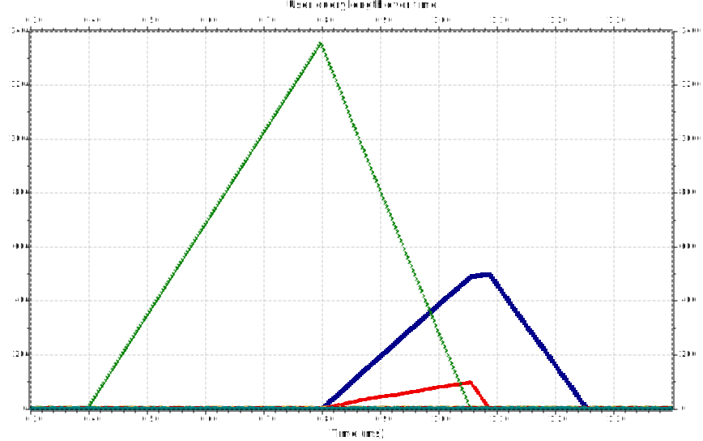
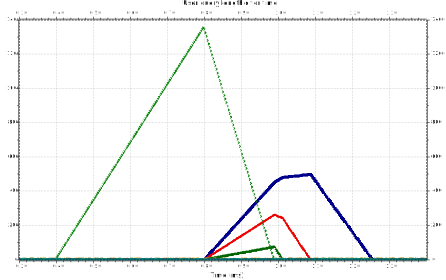
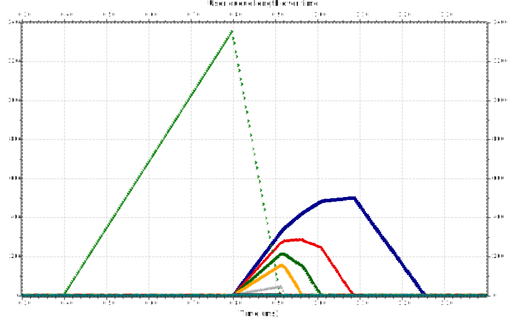

# Analysis for eight users

## Setup

We follow the recommended conditions:

- a scheduling cycle of **1 ms** (an LTE network);
- 30 channels which can be allocated.
  
For this analysis, we chose the following weights for the users: **w = [1, 2, 3, 4, 5, 6, 7, 8]**.

The user that gets disconnected is the user with the weight of 4.

## No tinkering - the weight of the user remains the same after reconnecting

The users with the smallest weights get affected, which is expected.

In this case, only the ones with the weights **1** and **2**.

 
 
 

## Some weight change - the reconnected user gets a weight of 8

The unlucky user gets the same weight as the user with the highest priority - a weight of 8. We can see that the user with the weight of 3 gets also affected by lag in this case.

 
 
 

## Medium weight change - the reconnected user gets a weight of 16

The other users start experiencing some lag.

 
 
 

## Heavy weight change - the reconnected user gets a weight of 24

At this point, most of the other users gather up considerable lag.

 
 
 

## Extreme weight change - the reconnected user gets a weight of 32

Yes, this clearly is unrealistic, especially because the newly allocated weight exceeds the number of channels which can be allocated.

We can see that the network won't allocate channels to any other user until the queue of the unlucky one gets depleted - causing heavy lag to everybody else.
